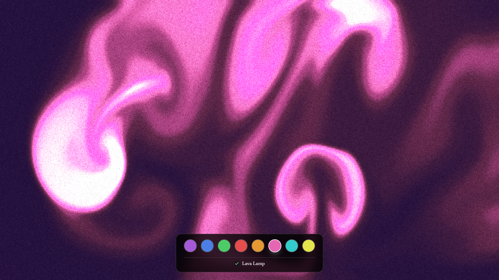
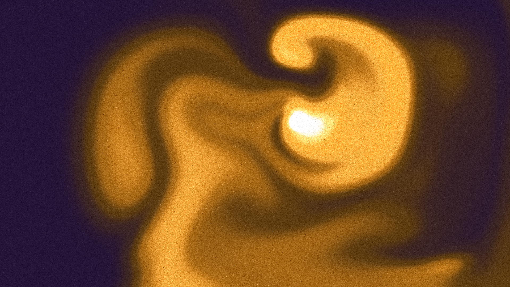

# FluxLab

## Play music by conducting magic smoke

FluxLab is an interactive art project that creates an intrument out of smoke.

The smoke is a real-time 2D fluid simulation. The movement of the fluid is calculated on the GPU, and the state of the simulation is sampled to control a browser-based synthesizer. The result is part visual instrument, part technical demonstration, and part excuse to drag a cursor through smoke a bunch.

See it live at <https://logandarby.github.io/flux-lab>.





- [Play music by conducting magic smoke](#play-music-by-conducting-magic-smoke)
- [Components](#components)
- [Features](#features)
- [Running the project](#running-the-project)
  - [Requirements](#requirements)
  - [Install and start the development server](#install-and-start-the-development-server)
- [Project structure](#project-structure)
- [References](#references)


## Components

FluxLab combines several components:

- Numerical simulation of fluid motion using the stable-fluids method from Stam, J. 1999, "Stable Fluids," in *Proceedings of SIGGRAPH 1999*
- WebGPU compute shaders for advection, diffusion, divergence, pressure, boundary conditions, and particle advection
- WebGPU rendering of the simulation textures
- ToneJS synthesis driven by the state of the simulation and the user's pointer
- A small WGSL preprocessor for shader includes, compile-time defines, template variables, and useful error messages
- Instrumentation for JavaScript time, frame rate, timestep, and GPU timestamp queries

## Features

- **Real-time fluid simulation** - Solves 2D fluid motion on a 512 by 256 grid using the stable-fluids method and WebGPU compute shaders.
- **GPU simulation pipeline** - Runs advection, diffusion, divergence, pressure, gradient subtraction, boundary conditions, dissipation, and particle advection passes.
- **GPU resource management** - Uses separate velocity, divergence, pressure, smoke density, and particle textures, with ping-pong buffers for read/write simulation states.
- **Configurable solver** - Supports adjustable workgroup size, timestep limits, diffusion and pressure iterations, dissipation, and interaction strength.
- **Smoke-driven music** - Samples the simulation textures and maps smoke density, cursor position, and movement to musical parameters.
- **ToneJS synthesis** - Includes an eight-voice polyphonic synth, pentatonic note mapping, timbral morphing, bass patterns, chorus, reverb, and ping-pong delay.
- **Reusable WebGPU abstractions** - Provides `ComputePass`, `RenderPass`, `TextureManager`, `UniformManager`, and `GPUTimer` classes.
- **Bind group caching** - Reuses device-specific bind group layouts to reduce repeated WebGPU setup work.
- **WGSL preprocessor** - Supports shader includes, compile-time defines, template variables, import-depth limits, and detailed errors for invalid or circular imports.
- **Batched input** - Collects pointer events until the next animation frame to avoid unnecessary work during interaction.
- **Lava-lamp mode** - Generates automatic smoke movement and pauses its scheduled activity when the browser window loses focus.
- **Performance instrumentation** - Tracks rolling averages for JavaScript time, FPS, simulation timestep, and GPU time when timestamp queries are supported.
- **Resource cleanup** - Explicitly releases simulation resources, event processors, audio state, and sampling intervals.

## Running the project

### Requirements

- Node.js and npm
- A browser with WebGPU enabled

WebGPU support varies by browser and operating system. Chrome or Chromium-based browsers are usually the easiest place to try the project. If WebGPU is unavailable, the simulation cannot initialize.

### Install and start the development server

```bash
npm install
npm run dev
```

Open the local URL printed by Vite. The production build can be created with:

```bash
npm run build
```

The deployed application uses the `/flux-lab` base path and is configured for GitHub Pages at:

<https://logandarby.github.io/flux-lab>

## References

- Stam, Jos. 1999. "Stable Fluids." *Proceedings of SIGGRAPH 1999*.
